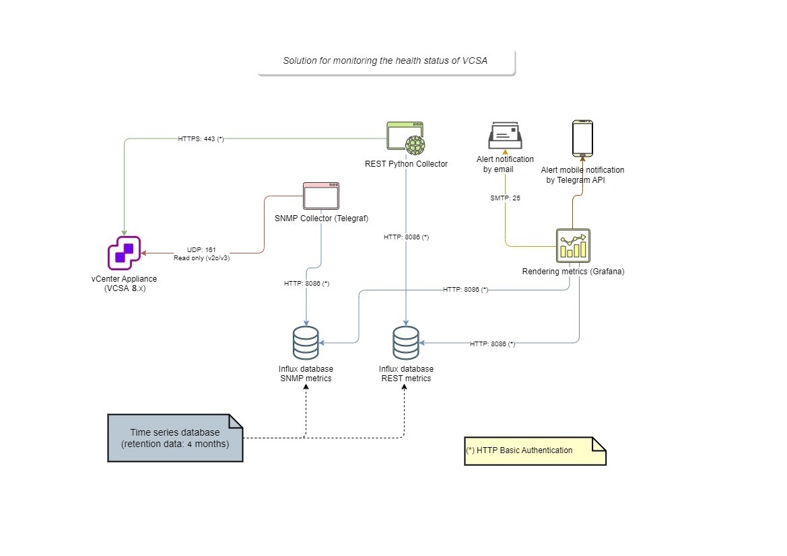
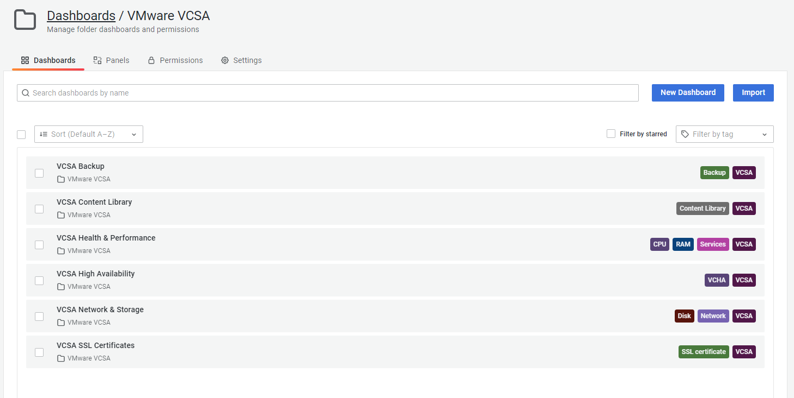
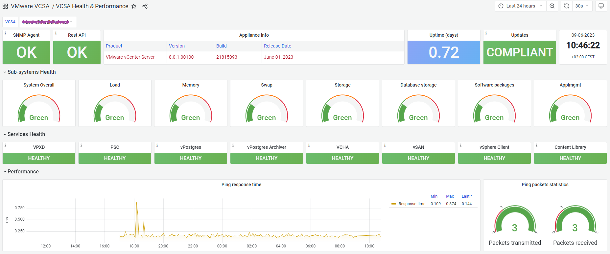
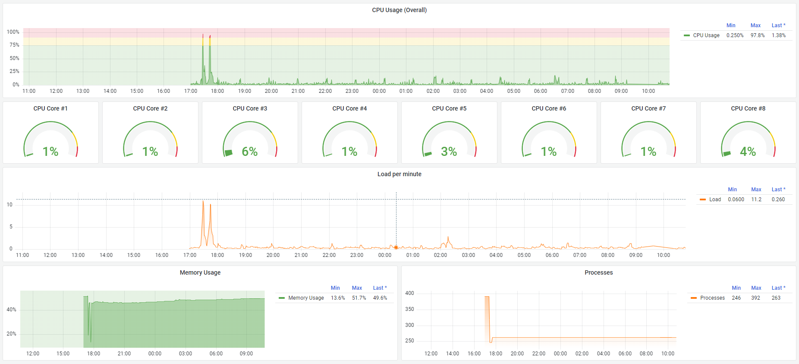
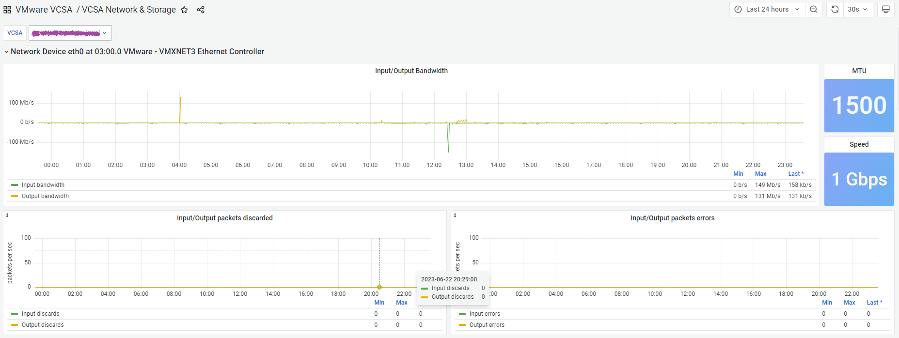
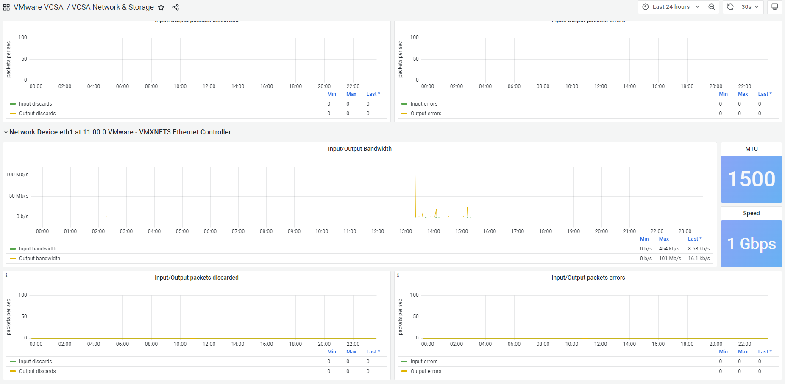
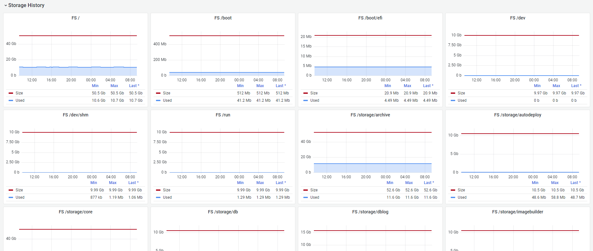
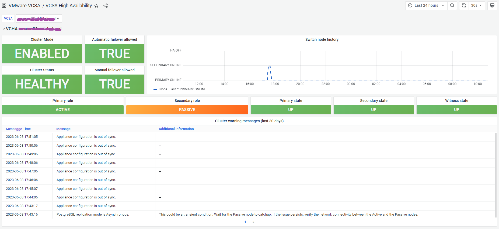
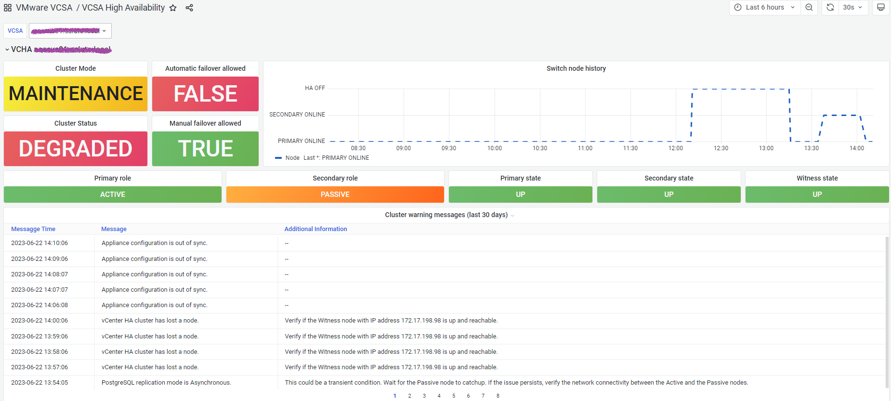

# SexiGraf addon for VCSA monitoring (tested on release 0.99i)

The original SexiGraf project has been enhanced by adding vCenter monitoring via SNMPv2c or SNMPv3 protocol and REST API.
For each connected vCenter Appliance (VCSA) it's possible to monitor:

* Uptime
* Current build installed
* Available updates
* Sub-systems health
* Services health
* VCHA cluster (a three-node cluster consisting of an active, passive and witness node) health status, current active node and warning messages history (last 30 days)
* CPU usage overall and by Cores
* Load average
* Active processes
* Memory usage
* Network bandwidth utilization on public and heartbeat ethernet interface
* All file systems and external shares usage (ex.: NFS mount point)
* Latest backup status
* Content Libraries Subscribed synchronization status
* Expiration time for critical SSL certificates

# Documentation

[SexiGraf web site project](https://www.sexigraf.fr/)

# Architecture

Original architecture:

Solution added to SexiGraf for VCSA monitoring:

The SexiGraf appliance must be able to communicate with the following ports:

* UDP 161 (SNMP Agent)
* TCP 443 (vCenter Service)
* TCP 22 (SSH)

Telegraf acquires SNMP metrics but also checks critical SSL certificates on TCP ports 443,7080 (7080 only from localhost) and verifies the mapping of logical volumes by SSH connection (TCP port 22).  

# Installation Addon

**Before starting the installation, enable a snapshot.**

1. Install InfluxDB on SexiGraf (for Ubuntu 20.04):
	* > ``curl -sL https://repos.influxdata.com/influxdb.key | sudo apt-key add -``
	* > ``echo "deb https://repos.influxdata.com/ubuntu bionic stable" | sudo tee /etc/apt/sources.list.d/influxdb.list``
	* > ``echo "deb https://repos.influxdata.com/ubuntu bionic stable" | sudo tee /etc/apt/sources.list.d/influxdb.list``
	* > ``apt update``
	* > ``apt install influxdb``
	* > ``systemctl status influxdb``
	* > ``systemctl enable --now influxdb``
	* > ``systemctl start influxdb``

2. Install on SexiGraf the following python modules: 
	* > ``pip install graphyte``
	* > ``pip install influxdb``

3. [Donwload project from GitHub](https://github.com/cislow970/sexigraf/archive/refs/heads/main.zip)

4. Copy InfluxDB config *influxdb.conf* from project folder /etc/influxdb/ in the same folder on SexiGraf appliance.

5. Launch influx client from command line: ``influx``

6. Submit Influx Query Language statements for create database, users and grants ([Reference guide InfluxDB](https://docs.influxdata.com/influxdb/v1.8/introduction/get-started/)):
	* > ``CREATE DATABASE vcsa_rest``
	* > ``CREATE DATABASE vcsa_telegraf``
	* > ``CREATE USER admin WITH PASSWORD 's3x1gr4f' WITH ALL PRIVILEGES``
	* > ``CREATE USER telegraf WITH PASSWORD 't3l3gr4f'``
	* > ``CREATE USER pollerpy WITH PASSWORD 'p0ll3rpy'``
	* > ``GRANT ALL ON vcsa_telegraf TO telegraf``
	* > ``GRANT ALL ON vcsa_rest TO pollerpy``
	* > ``CREATE RETENTION POLICY "four_months" ON "vcsa_telegraf" DURATION 16w REPLICATION 1``
	* > ``CREATE RETENTION POLICY "four_months" ON "vcsa_rest" DURATION 16w REPLICATION 1``
	* > ``DROP RETENTION POLICY autogen ON vcsa_telegraf``
	* > ``DROP RETENTION POLICY autogen ON vcsa_rest``

7. Exit from influx command line and restart service: ``systemctl restart influxdb.service``

8. Copy all files from project folder */etc/telegraf/telegraf.d/* in the same path on SexiGraf appliance (verify that permissions of uploaded files are 644 with ownership root:root).

9. Copy directory *templates* from project folder */etc/telegraf/* in the same path on SexiGraf appliance.

10. Copy file from project folder */etc/grafana/provisioning/dashboards/* in the same path on SexiGraf appliance (make the ownership and permissions of the uploaded file consistent with those already present).

11. Copy file from project folder */mnt/wfs/inventory/* in the same path on SexiGraf appliance (verify that permissions of uploaded file are 644 with ownership www-data:www-data).

12. Copy directory *vcsa_monitor* from project folder */usr/lib/python3.8/* in the same path on SexiGraf appliance.

13. Copy all files from project folder */usr/local/bin/* in the same path on SexiGraf appliance (verify that permissions of uploaded files are 755 with ownership root:root).

14. Copy directory *VMware_VCSA* from project folder */var/lib/grafana/dashboards/* in the same path on SexiGraf appliance.

15. Copy directory *grafana-clock-panel* from project folder */var/lib/grafana/plugins/* in the same path on SexiGraf appliance.

16. Copy all content from project folder */var/www/admin/* in the same path on SexiGraf appliance (verify that permissions of uploaded files are 644 with ownership www-data:www-data).

17. Copy all files from project folder */var/www/scripts/* in the same path on SexiGraf appliance (verify that permissions of uploaded files are 644 with ownership www-data:www-data).

18. Create ssh key for user telegraf on SexiGraf appliance:
	* Edit file */etc/passwd* and change shell from **/bin/false** to **/bin/bash**
	* Submit command: ``su - telegraf``
	* Submit command: ``ssh-keygen``
	* Check for the newly generated ssh keys in the path */etc/telegraf/.ssh*
	* Submit command: ``exit``
	* Edit file */etc/passwd* and change shell from **/bin/bash** to **/bin/false**

19. Make file *vcsa_monitor_kill* in path */etc/cron.d* on SexiGraf appliance with following content:  
	``0 */1 * * * root /usr/local/bin/vcsa_monitor_kill.sh >/dev/null 2>&1``

20. Reboot SexiGraf appliance.

# Configuration Addon

## Change default shell for root user on VCSA

Edit **/etc/password** file and change root user shell from */bin/appliancesh* to */bin/bash*.

## Configure SNMP agent on VCSA

**The SNPM v2c and v3 protocols are alternatives.**

* Configure SNMP v2c protocol

	Launch **appliancesh** shell and submit the following commands:

	1. Verify configuration agent: ``snmp.get``
	2. Enable snmp agent: ``snmp.enable``
	3. Setting community name: ``snmp.set --communities public``    
		*(public is just a sample community, you can set the community you want to use in your network, you should write it down and enter it in the configuration of the [connection to the vCenter](https://github.com/cislow970/sexigraf#add-connection-to-vcsa-in-sexigraf-web-admin-gui-enhanced) in SexiGraf)*
	4. Check again configuration agent: ``snmp.get``

* Configure SNMP v3 protocol

	Launch **appliancesh** shell and submit the following commands:

	1. Verify configuration agent: ``snmp.get``
	2. Enable snmp agent: ``snmp.enable``
	3. Remove communities if present (to disable the v2c protocol): ``snmp.set --communities ""``
	4. Set authentication protocol: ``snmp.set --authentication SHA1``
	5. Set privacy protocol: ``snmp.set --privacy AES128``
	6. Set password for authentication and privacy: ``snmp.hash --auth_hash secret1 --priv_hash secret2``    
		*(secret1 and secret2 are respectively your passwords for auth and priv, you should write them down and enter them in the configuration of the [connection to the vCenter](https://github.com/cislow970/sexigraf#add-connection-to-vcsa-in-sexigraf-web-admin-gui-enhanced) in SexiGraf)*
	7. Set user for SNMP v3: ``snmp.set --user userid/secret1/secret2/priv``    
		*(userid is the user you defined for the encrypted and authenticated connection to SNMP v3 agent, you should write it down and enter it in the configuration of the [connection to the vCenter](https://github.com/cislow970/sexigraf#add-connection-to-vcsa-in-sexigraf-web-admin-gui-enhanced) in SexiGraf)*
	8. Check again configuration agent: ``snmp.get``  

## Create and configure monitor user on VCSA

1. Configure monitor user for SexiGraf:

	1. Launch **appliancesh** shell and submit the following command:  
	``localaccounts.user.add --role operator --username monitor --password``    
		*(enter password equal to M0n1t0r! or whatever you want but as long as it meets the complexity criteria of the VCSA)*

	2. Exit from **appliancesh** and submit the following commands:  
	``mkdir -p /home/monitor/.ssh``  
	``touch /home/monitor/.ssh/authorized_keys``  
	``chmod 700 /home/monitor/.ssh/``  
	``chmod 600 /home/monitor/.ssh/authorized_keys``  
	``chown -R monitor:users /home/monitor/.ssh/``  

2. Edit **/etc/password** file and change monitor user shell from */bin/appliancesh* to */bin/bash*.

## Configure SexiGraf public key on VCSA

Edit file **/home/monitor/.ssh/authorized_keys** and add RSA key of telegraf user on SexiGraf (example):

``ssh-rsa AAAAB3NzaC1yc2EAAAADAQABAAABgQDHH34hzRsItP9rXYyx1kz5hlApXr/LaWL5ODnf8HK1M3B1HoZ/bVL5T8uVBc4ipNiog04l2CfWMXyxa1tIcRG5IsDrR//RPDe4gauPYvb74LIEga4D+0TGy6nUgLPEMPxTeX2ry7SpS54rWz4ccQ2m4Q0gtqKutbKYkioUplsjshKGICsyN5iKmsIm2sJ2w2INvTRRyRZwynPjOJ7XVUaiPNsvpnkP5qRup7uOVOVlW4vo/X66fsu7CA4q8yGmE3v5QP9pgeAfZ6/PhJ5I6K7CMvDZu4YrX5+FxwI5nZrKy49SdqXV0pbegnbqR3lSFngz8XvRCDBvseeZ42yl0mFNos30owSm6r9H97tTSssQao7QgZdTm6evbbkNm/TDst+GiVKsg/lADUODMAhaqbxJ/8uzHIMS8tLmLvNCpC1T2z4nHNGVOAeF46HOyQWRKxFwsvP/tgoVkuMqyEm3Y/wPhvmAwxH1Ezi2yI7GtpyZMszjI8SCuyEbZJfDH/5091U= telegraf@sexigraf``

*(RSA key correct can be viewed with the command ``cat /etc/telegraf/.ssh/id_rsa.pub`` on SexiGraf appliance)*

## Enable SSH login with public key authentication on VCSA

For enabling SSH key authentication edit **/etc/ssh/sshd_config** file and add following row (or uncomment):

``PubkeyAuthentication yes``

After saving, restart SSH service:

``systemctl restart sshd.service``

## Configure python script for checking Secure Token Service Certificate on VCSA

1. Copy script **checksts_sg.py** from repository folder *vcsa/usr/local/bin/* in the path */usr/local/bin* on VCSA
2. Assign to script execution permission and ownership to **monitor** user

## Add connection to VCSA in SexiGraf Web Admin GUI (enhanced)

You can add a connection for each vCenter 8.x in your infrastructure:  

## New VCSA dashboards on SexiGraf

  

* VCSA Health and Performance:  

  

* VCSA Network and Storage:  

  

* VCHA cluster:  

  
  

* VCSA Backup:  

  

* VCSA Content Library:  

  

* VCSA SSL certificates:  

  

